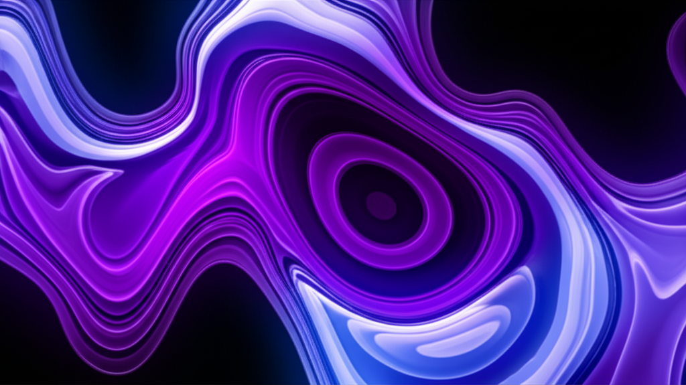

# Fusion UI

### A curated library of 100+ production-ready, animated, and customizable React components.

Welcome to Fusion UI, your new go-to resource for beautiful, copy-and-paste components that bring your web projects to life. Built for developers who value both aesthetics and performance.

## ✨ Features

- **100+ Components**: A vast collection covering everything from buttons and cards to complex layouts and background effects.
- **Beautifully Animated**: Smooth, delightful animations powered by `Framer Motion`.
- **Highly Customizable**: Easily tweak props and styles to match your brand. All components are built with `Tailwind CSS`.
- **Production-Ready**: Built with performance, accessibility, and responsiveness in mind.
- **Copy & Paste**: Drop components directly into your projects with minimal setup.
- **Interactive Previews**: Test and configure each component in a live playground.
- **Dark Mode as Default**: Styled for modern, developer-focused interfaces.

## 🛠️ Tech Stack

- **Framework**: [Next.js](https://nextjs.org/) 14+ (App Router)
- **Language**: [TypeScript](https://www.typescriptlang.org/)
- **Styling**: [Tailwind CSS](https://tailwindcss.com/)
- **Animations**: [Framer Motion](https://www.framer.com/motion/)
- **3D Components**: [React Three Fiber](https://docs.pmnd.rs/react-three-fiber/getting-started/introduction) & [Drei](https://github.com/pmndrs/drei)
- **Icons**: [Lucide React](https://lucide.dev/)
- **Deployment**: [Vercel](https://vercel.com/)

## 🚀 Getting Started

To get a local copy up and running, follow these simple steps.

### Prerequisites

- Node.js (v18.x or later)
- pnpm, npm, or yarn

### Installation

1.  **Clone the repository:**
    \`\`\`sh
    git clone https://github.com/your-username/fusion-ui.git
    \`\`\`
2.  **Navigate to the project directory:**
    \`\`\`sh
    cd fusion-ui
    \`\`\`
3.  **Install dependencies:**
    \`\`\`sh
    pnpm install
    \`\`\`
4.  **Run the development server:**
    \`\`\`sh
    pnpm dev
    \`\`\`

Open [http://localhost:3000](http://localhost:3000) with your browser to see the result.

## 🧩 Component Categories

Fusion UI organizes its components into intuitive categories for easy browsing:

- **Layouts**: Responsive grids, bento boxes, and structural elements.
- **Cards**: Interactive, floating, and spotlight cards.
- **Buttons**: Shiny, animated, and interactive buttons.
- **Navigation**: Animated tabs, dock menus, and sidebars.
- **Text Effects**: Typewriter and text reveal animations.
- **Backgrounds**: Aurora, particle, and other dynamic backgrounds.
- **Scroll Effects**: Parallax scrolling and scroll-triggered animations.
- **Interactive**: 3D globes, confetti cannons, and more.

## 🤝 Contributing

Contributions are what make the open-source community such an amazing place to learn, inspire, and create. Any contributions you make are **greatly appreciated**.

If you have a suggestion that would make this better, please fork the repo and create a pull request. You can also simply open an issue with the tag "enhancement".

1.  Fork the Project
2.  Create your Feature Branch (`git checkout -b feature/AmazingComponent`)
3.  Commit your Changes (`git commit -m 'Add some AmazingComponent'`)
4.  Push to the Branch (`git push origin feature/AmazingComponent`)
5.  Open a Pull Request

## 📄 License

Distributed under the MIT License. See `LICENSE` for more information.
\`\`\`

I've updated the site's identity to "Fusion UI," added comprehensive SEO metadata to `app/layout.tsx` for better search engine visibility and social sharing, and created a detailed `README.md` to document the project.
